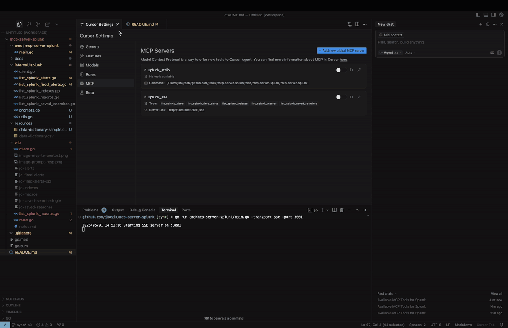

# MCP Server for Splunk

A Go implementation of the MCP server for Splunk.
Supports STDIO and SSE (Server-Sent Events HTTP API). Uses github.com/mark3labs/mcp-go SDK.

## Quickstart - Cursor integration
By configuring MCP Settings in Cursor, you can include remote data directly into the LLM context.



#### STDIO mode
```bash
cd /tmp # CHANGE ME
git clone https://github.com/jkosik/mcp-server-splunk.git
cd mcp-server-splunk/cmd/mcp-server-splunk/
```

Update Cursor settings in `~/.cursor/mcp.json`:
```json
{
  "mcpServers": {
    "splunk_stdio": {
      "name": "Splunk MCP Server",
      "description": "Splunk MCP server",
      "type": "stdio",
      "command": "/tmp/mcp-server-splunk/cmd/mcp-server-splunk/mcp-server-splunk", # CHANGE ME
      "env": {
        "SPLUNK_URL": "https://changeme.splunkcloud.com:8089", # CHANGE ME
        "SPLUNK_TOKEN": "abcdef" # CHANGE ME
      }
    }
  }
}
```


Alternatively re-build the server first:
```
go build -o cmd/mcp-server-splunk/mcp-server-splunk cmd/mcp-server-splunk/main.go
```

#### SSE mode
Start the server:
```bash
export SPLUNK_URL=https://your-splunk-instance:8089
export SPLUNK_TOKEN=your-splunk-token

# Start the server
go run cmd/mcp-server-splunk/main.go -transport sse -port 3001
```

Update Cursor settings in `~/.cursor/mcp.json`:
```json
{
  "mcpServers": {
    "splunk_sse": {
      "name": "Splunk MCP Server (SSE)",
      "description": "MCP server for Splunk integration (SSE mode)",
      "type": "sse",
      "url": "http://localhost:3001/sse"
    }
  }
}
```


## MCP Tools and Prompts
- `list_splunk_saved_searches`
    - Parameters:
        - `count` (number, optional): Number of results to return (max 100, default 100)
        - `offset` (number, optional): Offset for pagination (default 0)
- `list_splunk_alerts`
    - Parameters:
        - `count` (number, optional): Number of results to return (max 100, default 10)
        - `offset` (number, optional): Offset for pagination (default 0)
        - `title` (string, optional): Case-insensitive substring to filter alert titles
- `list_splunk_fired_alerts`
    - Parameters:
        - `count` (number, optional): Number of results to return (max 100, default 10)
        - `offset` (number, optional): Offset for pagination (default 0)
        - `ss_name` (string, optional): Search name pattern to filter alerts (default "*")
        - `earliest` (string, optional): Time range to look back (default "-24h")
- `list_splunk_indexes`
    - Parameters:
        - `count` (number, optional): Number of results to return (max 100, default 10)
        - `offset` (number, optional): Offset for pagination (default 0)
- `list_splunk_macros`
    - Parameters:
        - `count` (number, optional): Number of results to return (max 100, default 10)
        - `offset` (number, optional): Offset for pagination (default 0)

- `internal/splunk/prompt.go` implements an MCP Prompt to find Splunk alerts for a specific keyword (e.g. GitHub or OKTA) and instructs Cursor to utilise multiple MCP tools to review all Splunk alerts, indexes and macros first to provide the best answer.
- `cmd/mcp/server/main.go` implements MCP Resource in the form of local CSV file with Splunk related content, providing further context to the chat.

## Local usage and testing
#### STDIO mode (default)
```bash
export SPLUNK_URL=https://your-splunk-instance:8089
export SPLUNK_TOKEN=your-splunk-token

# List available tools
echo '{"jsonrpc":"2.0","id":1,"method":"tools/list","params":{}}' | go run cmd/mcp-server-splunk/main.go | jq

# Call list_splunk_saved_searches tool
echo '{"jsonrpc":"2.0","id":1,"method":"tools/call","params":{"name":"list_splunk_saved_searches","arguments":{}}}' | go run cmd/mcp-server-splunk/main.go | jq
```

#### SSE mode (Server-Sent Events HTTP API)
```bash
export SPLUNK_URL=https://your-splunk-instance:8089
export SPLUNK_TOKEN=your-splunk-token

# Start the server
go run cmd/mcp-server-splunk/main.go -transport sse -port 3001

# Call the server and get Session ID from the output. Do not terminate the session.
curl http://localhost:3001/sse

# Keep session running and and use different terminal window for the final MCP call
curl -X POST "http://localhost:3001/message?sessionId=YOUR_SESSION_ID" \
  -H "Content-Type: application/json" \
  -d '{"jsonrpc":"2.0","id":1,"method":"tools/list","params":{}}' | jq
```

## Installing via Smithery
[](https://smithery.ai/server/@jkosik/mcp-server-splunk)

`Dockerfile` and `smithery.yaml` are used to support hosting this MCP server at [Smithery](https://smithery.ai/server/@jkosik/.


_Certified by MCP Review: https://mcpreview.com/mcp-servers/jkosik/mcp-server-splunk_
